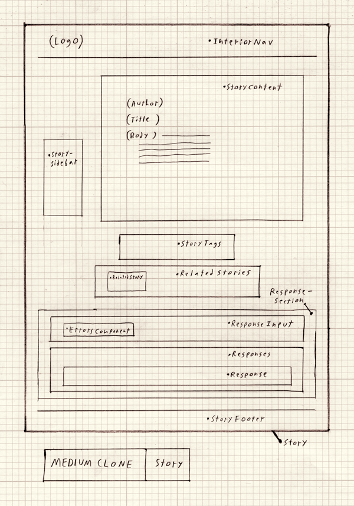
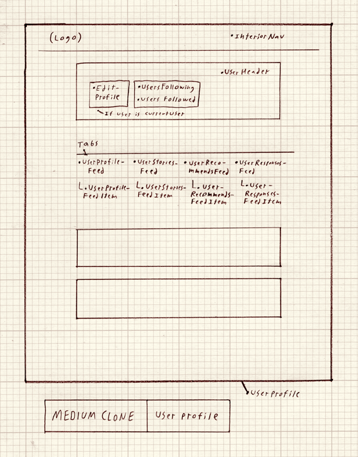

# Message

[Message live][heroku]

[heroku]: http://message-medium.herokuapp.com/

Message is a full-stack single-page web application inspired by the blog/news site Medium. It utilizes Ruby on Rails (backend), PostgreSQL (database), and React.js/Redux (frontend). The goal of Message is to provide an elegant and inviting experience for both the reading and writing of stories.

## Features & Implementation 

### Writing and editing stories and responses

Users may write their own stories via a spare, clean interface - the almost-entirely white page is meant to emulate the feeling of a blank sheet of paper. The more-complex functionality only becomes evident after some interaction: image uploading and linked topics via database associations, and rich text editing using tools adapted from the QuillJS library. In order to achieve the desired experience, I had to heavily edit the Quill interface. The database stores stories in specially-formatted HTML, which can then be rendered via React.

Users may leave responses on stories or on other responses. The chain of responses (sorted by time and by comment thread) is managed through JavaScript algorithms; using the Redux architecture, users may seamlessly leave responses or edit their own responses.

Below is an initial wireframe drawing of the individual story page (note that the sidebar component is used to display that story's likes):

### Follows

Users may 'follow' other users by clicking on a modular React component. In addition to the user's information, each user profile page contains three feeds: stories and responses written by that user, stories and responses which have been liked by that user, and stories and responses by users followed by that user. This information is quickly retrieved from the server thanks to a series of associations between multiple database tables (`users`, `stories`, `responses`, `likes`, `follows`, and `followings`). Users may view these feeds by clicking on a custom SVG icon menu.

Below is an initial wireframe drawing of the user profile page:

### Likes

Through the Rails backend, stories are associated with topics and can be 'liked' by users. Database associations allow for a record of all stories and responses that any user has liked. By comparing data from the `likes` table with user information, various React components can detect whether or not the logged-in user has liked a story or response, updating their styles accordingly. 

The goal was to seamlessly integrate the experience of 'liking' into the site, i.e. by showing a story's 'likes' in a sidebar that appears and disappears according to the user's positiion in the story (via JavaScript and CSS).

## Future Directions for the Project

In addition to the features already implemented, I plan to continue work on this project.

### Search

By utilizing the pg-search Ruby gem, I can integrate text-based search into the site.

### Highlights

Medium allows users to highlight sections of stories that they particularly like. It would be possible to achieve a similar functionality on Message by storing information about each highlighted passage in the database and rendering the highlights via CSS.
