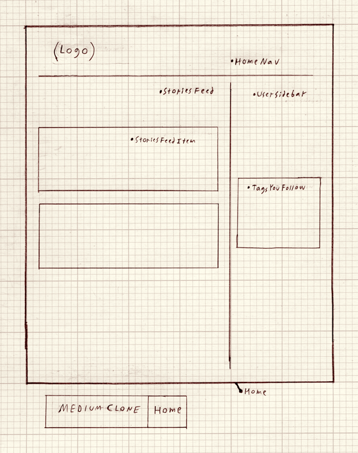

# Message

[Message live][heroku]

[heroku]: http://message-medium.herokuapp.com/

Message is a full-stack single-page web application inspired by Medium. It utilizes Ruby on Rails (backend), PostgreSQL (database), and React.js/Redux (frontend).  

## Features & Implementation 

### Writing and editing stories and responses

User may write their own stories via a spare, clean interface - the almost-entirely white page is meant to emulate the feeling of a blank sheet of paper. 



Note editing is implemented using the Quill.js library, allowing for a Word-processor-like user experience.

### Notebooks

Implementing Notebooks started with a notebook table in the database.  The `Notebook` table contains two columns: `title` and `id`.  Additionally, a `notebook_id` column was added to the `Note` table.  

The React component structure for notebooks mirrored that of notes: the `NotebookIndex` component renders a list of `CondensedNotebook`s as subcomponents, along with one `ExpandedNotebook`, kept track of by `NotebookStore.selectedNotebook()`.  

`NotebookIndex` render method:

```javascript
render: function () {
  return ({this.state.notebooks.map(function (notebook) {
    return <CondensedNotebook notebook={notebook} />
  }
  <ExpandedNotebook notebook={this.state.selectedNotebook} />)
}
```

### Tags

As with notebooks, tags are stored in the database through a `tag` table and a join table.  The `tag` table contains the columns `id` and `tag_name`.  The `tagged_notes` table is the associated join table, which contains three columns: `id`, `tag_id`, and `note_id`.  

Tags are maintained on the frontend in the `TagStore`.  Because creating, editing, and destroying notes can potentially affect `Tag` objects, the `NoteIndex` and the `NotebookIndex` both listen to the `TagStore`.  It was not necessary to create a `Tag` component, as tags are simply rendered as part of the individual `Note` components.  


## Future Directions for the Project

In addition to the features already implemented, I plan to continue work on this project.  The next steps for FresherNote are outlined below.

### Search

Searching notes is a standard feature of Evernote.  I plan to utilize the Fuse.js library to create a fuzzy search of notes and notebooks.  This search will look go through tags, note titles, notebook titles, and note content.  

### Direct Messaging

Although this is less essential functionality, I also plan to implement messaging between FresherNote users.  To do this, I will use WebRTC so that notifications of messages happens seamlessly.  
